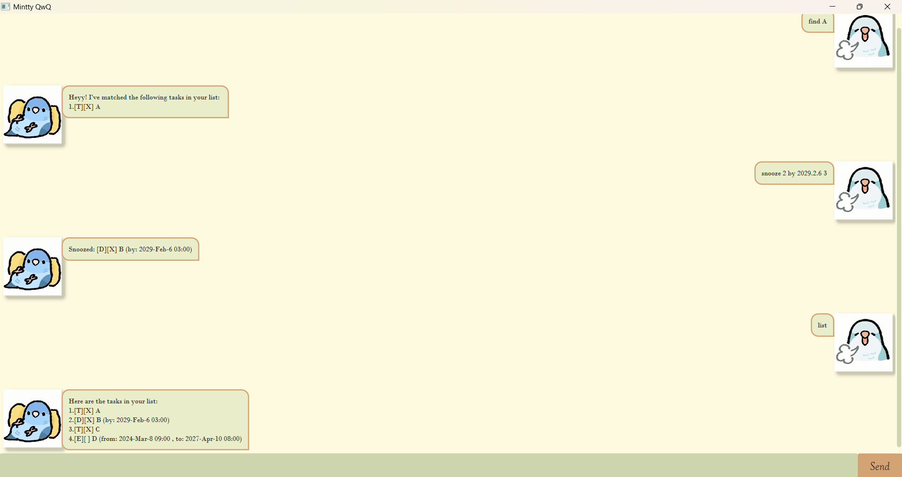

# Mintty User Guide

Mintty is a desktop app for managing tasks, 
optimized for use via a Command Line Interface (CLI) while still having the benefits of a Graphical User Interface (GUI). 
If you can type fast, Mintty can get your task management done faster than traditional GUI apps. 
Whether you are tracking assignments or scheduling personal events, Mintty helps you stay on top of your schedule.


## Table of Contents

* [Quick Start](#quick-start)
* [Features](#features)
  * [Adding a Todo task: `Todo`](#1-todo)
  * [Adding a Deadline task: `Deadline`](#2-deadline)
  * [Adding an Event task: `Event`](#3-event)
  * [Listing out all tasks: `List`](#4-list)
  * [Marking a task as done: `Mark`](#5-mark)
  * [Marking a task as not done: `Unmark`](#6-unmark)
  * [Searching a task: `Find`](#7-find)
  * [Deleting a task: `Delete`](#8-delete)
  * [Snoozing a task: `Snooze`](#9-snooze)
  * [Exiting the program: `Bye`](#10-bye)
* [Command Summary](#command-summary)
* [Contributing](#contributing)


## Quick Start

1. Ensure you have Java `17` or above installed in your Computer.
2. Download the latest `mintty.jar` from [here](https://github.com/ChenHongshan333/ip).
3. Copy the file to the folder you want to use as the home folder for your Mintty.
4. Double-click the file to start the app. The GUI similar to the screenshot below should appear in a few seconds.
5. Type the command in the command box and press Enter to execute it. e.g. typing `list` and pressing Enter will display all your current tasks.


> A screenshot of Mintty's UI


## Features

> **Notes about the command format:**
> * Words in `UPPER_CASE` are the parameters to be supplied by the user.
> * Extraneous parameters for commands that do not take in parameters (such as `list`, `bye`) will be ignored.

### 1. Todo

Adds a basic task without any date or time constraints to the list.

**Format:** `todo DESCRIPTION`

**Example:** `todo Take shower`

**Expected outcome:**
```text
Okie!! I've added this to the task list:
2.[T][ ] Take shower
Now you have 2 tasks in total.
```

### 2. Deadline

Adds a task that needs to be done before a specific date/time.

**Format:** `deadline DESCRIPTION /by DATETIME`

**Example:** `deadline CS2109S midterm /by: 2026-Mar-2 6pm`

**Expected outcome:**
```text
Okie!! I've added this to the task list:
3.[D][ ] CS2109S midterm (by: 2026-Mar-2 18:30)
Now you have 3 tasks in total.
```

### 3. Event

Adds a task that starts at a specific time and ends at a specific time.

**Format:** `event DESCRIPTION /from START_DATETIME /to END_DATETIME`

**Example:** `event prepare for FFC /from 2025.12.3 9pm /to 2026.8.5 11pm`

**Expected outcome:**
```text
Okie!! I've added this to the task list:
4.[E][ ] prepare for FFC (from: 2025-Dec-3 21:00, to: 2026-Aug-5 23:00)
Now you have 4 tasks in total.
```

### 4. List

Shows a list of all tasks currently stored in Mintty.

**Format:** `list`

**Expected outcome:**
```text
Here are the tasks in your list:
1.[T][X] take shower
2.[D][ ] CS2109S midterm (by: 2026-Mar-2 18:30)
```

### 5. Mark

Marks the specified task from the list as completed.

**Format:** `mark INDEX`
> * `INDEX` refers to the index number shown in the displayed task list.
> * The index **must be a positive integer** (e.g., 1, 2, 3...).

**Example:** `mark 2`

**Expected outcome:**
```text
Niceee! I've marked this task as done:
[D][X] CS2109S midterm (by: 2026-Mar-2 18:30)
```

### 6. Unmark

Reverts a completed task back to an uncompleted state.

**Format:** `unmark INDEX`

**Example:** `unmark 2`

**Expected outcome:**
```text
Okie, I've marked this task as not done yet:
[D][ ] CS2109S midterm (by: 2026-Mar-2 18:30)
```

### 7. Find

Finds tasks whose description matches the given keyword(s).

**Format:** `find KEYWORD`

**Example:** `find CS2109S`

**Expected outcome:**
```text
Heyyy! I've matched the following tasks in your list:
2.[D][ ] CS2109S midterm (by: 2026-Mar-2 18:30)
```

### 8. Delete

Deletes the specified task from the list.

**Format:** `delete INDEX`

**Example:** `delete 2`

**Expected outcome:**
```text
Okie!! I've removed this from the task list:
2.[D][ ] CS2109S midterm (by: 2026-Mar-2 18:30)
Now you have 1 tasks in total.
```

### 9. Snooze

Postpones or reschedules a Deadline or Event task to a new date/time.
> 💡 **Note:** This feature does not support `Todo` tasks, as they do not have time constraints.

**Format:** 
* For a Deadline: `snooze INDEX by NEW_DATETIME`
* For an Event:
  * `snooze INDEX from NEW_START_DATETIME to NEW_END_DATETIME`
  * `snooze INDEX to NEW_END_DATETIME`
  * `snooze INDEX from NEW_START_DATETIME`

**Example:** `snooze 2 to 2026-Mar-3 6pm`

**Expected outcome:**
```text
Snoozed: [E][ ] Event (from: XXXX, to: 2026-Mar-3 18:00)
```

### 10. Bye

Exits the program and saves your tasks automatically.

**Format:** `bye`

**Expected outcome:**
```text
Nice to talk to you^^
See you!
```


## Command Summary

| Action | Format, Examples |
| :--- | :--- |
| **Todo** | `todo DESCRIPTION` <br> e.g., `todo Take shower` |
| **Deadline** | `deadline DESCRIPTION /by DATETIME` <br> e.g., `deadline CS2109S midterm /by: 2026-Mar-2 6pm` |
| **Event** | `event DESCRIPTION /from START_DATETIME /to END_DATETIME` <br> e.g., `event prepare for FFC /from 2025.12.3 9pm /to 2026.8.5 11pm` |
| **List** | `list` |
| **Mark** | `mark INDEX` <br> e.g., `mark 2` |
| **Unmark** | `unmark INDEX` <br> e.g., `unmark 2` |
| **Find** | `find KEYWORD` <br> e.g., `find CS2109S` |
| **Delete** | `delete INDEX` <br> e.g., `delete 2` |
| **Snooze** | `snooze INDEX by NEW_DATETIME` (Deadline) <br> `snooze INDEX from NEW_START_DATETIME to NEW_END_DATETIME` (Event) <br> e.g., `snooze 2 to 2026-Mar-3 6pm` |
| **Bye** | `bye` |


## Contributing
[Hongshan](https://github.com/ChenHongshan333), 
<br>
for CS2103T AY25/26 sem 2 iP (individual project).